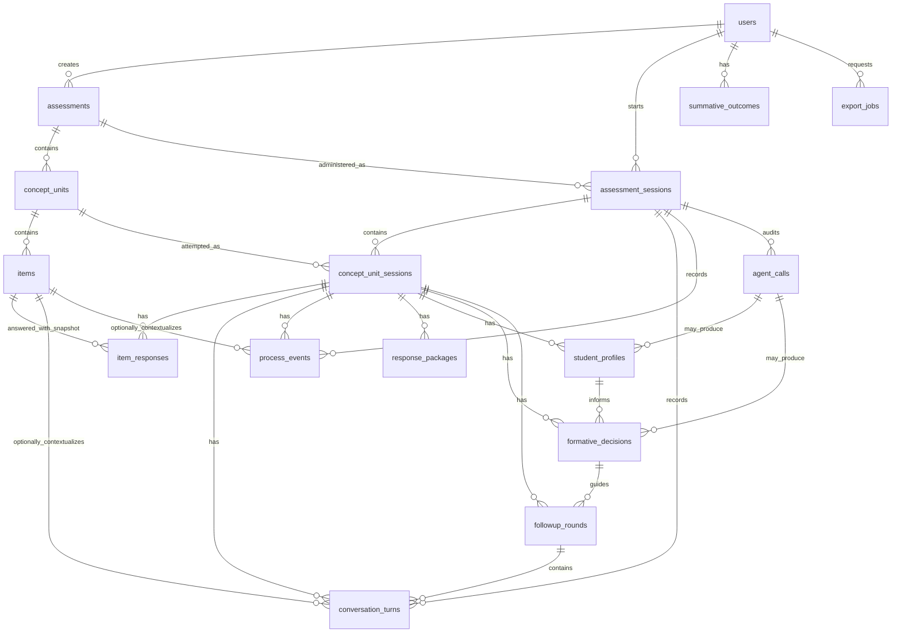

# Data Model

Phase 2A added the normalized database foundation for the classroom prototype. Later sections document the incremental Phase 2B, Phase 3, Phase 4, and Phase 5A additions. The data model still does not imply LLM calls, follow-up orchestration, summative upload, or CSV export.

## Identifier Convention

- Internal database relations use UUID primary keys named `id`.
- Internal foreign keys use `*_db_id`.
- Public, classroom, route, and export identifiers use explicit public fields:
  - `users.user_id`
  - `assessments.assessment_public_id`
  - `concept_units.concept_unit_public_id`
  - `items.item_public_id`
  - `assessment_sessions.session_public_id`
- Internal UUIDs should not be used as classroom IDs, research IDs, route IDs, or export IDs by default.
- Timestamps use PostgreSQL `TIMESTAMPTZ` so they are stored consistently as UTC instants.

## Model Purposes

- `users`: Existing auth users. `user_id` is the classroom and research linkage ID.
- `assessments`: Top-level assessment containers created by a teacher researcher.
- `concept_units`: Concept-based item sets. A service-layer rule will later enforce 3 to 4 items.
- `items`: Versioned MCQ item content, including structured options, rationales, expected reasoning, misconception indicators, administration rules, and the teacher-selected `included_in_published_set` membership flag.
- `assessment_sessions`: A student assessment attempt for one assessment.
- `concept_unit_sessions`: A student's progress through a concept unit within a session.
- `item_responses`: Initial item responses with correctness, confidence, reasoning, idempotency, and item content snapshots.
- `student_action_idempotency_keys`: Student action idempotency records for repeated browser requests during initial administration.
- `conversation_turns`: Student, agent, system, orchestrator, and teacher-researcher messages across initial and follow-up phases.
- `process_events`: Process telemetry such as page visibility, pauses, invalid help requests, prompt injection attempts, and phase events.
- `agent_calls`: Audit storage for future LLM calls. Phase 2A creates the table but does not call any LLM.
- `response_packages`: Structured packages assembled for downstream profiling/planning. `package_type` remains a string in the database but is validated in TypeScript.
- `student_profiles`: Storage for the three-layer profile: ability, engagement, and integrated diagnostic profile.
- `formative_decisions`: Storage for formative value decisions and action plans.
- `followup_rounds`: Iterative follow-up rounds. There is no pedagogical maximum number of rounds.
- `summative_outcomes`: Future linkage to supervised summative assessment scores by `users.user_id`.
- `export_jobs`: Future export job tracking. CSV generation is not implemented in Phase 2A.

## Key Relations

- `assessments.created_by_user_db_id -> users.id`
- `concept_units.assessment_db_id -> assessments.id`
- `items.concept_unit_db_id -> concept_units.id`
- `assessment_sessions.user_db_id -> users.id`
- `assessment_sessions.assessment_db_id -> assessments.id`
- `student_action_idempotency_keys.assessment_session_db_id -> assessment_sessions.id`
- `concept_unit_sessions.assessment_session_db_id -> assessment_sessions.id`
- `concept_unit_sessions.concept_unit_db_id -> concept_units.id`
- `item_responses.concept_unit_session_db_id -> concept_unit_sessions.id`
- `item_responses.item_db_id -> items.id`
- `conversation_turns`, `process_events`, and `agent_calls` attach to assessment sessions and optionally concept-unit sessions or items.
- `student_profiles`, `formative_decisions`, `followup_rounds`, and `response_packages` attach to concept-unit sessions.
- `summative_outcomes.user_db_id -> users.id` and also stores `user_id_snapshot`.

## Uniqueness Constraints

- Public IDs are unique for assessments, concept units, items, and assessment sessions.
- `concept_units`: unique `assessment_db_id + order_index`.
- `items`: unique `concept_unit_db_id + item_order`.
- `assessment_sessions`: unique `user_db_id + assessment_db_id + attempt_number` so v1 has one default attempt while future teacher-authorized retakes can use attempt 2 or later.
- `concept_unit_sessions`: unique `assessment_session_db_id + concept_unit_db_id`.
- `item_responses`: unique `concept_unit_session_db_id + item_db_id` to prevent duplicate initial responses.
- `item_responses`: unique `concept_unit_session_db_id + client_submission_id` for idempotent client submission handling.
- `student_action_idempotency_keys`: unique `assessment_session_db_id + client_action_id` for idempotent item actions.
- `followup_rounds`: unique `concept_unit_session_db_id + round_index`.

The schema intentionally avoids constraints that would prevent future legitimate reassessment attempts across different assessment sessions.

## Indexes

The schema indexes:

- Public IDs through unique indexes.
- Assessment/session lookup by user, assessment, status, and phase.
- Student action idempotency by session and action type.
- Concept-unit ordering within assessments.
- Item ordering within concept units.
- Conversation turns by session and time.
- Process events by session, concept-unit session, event type, item, and occurrence time.
- Agent calls by session, concept-unit session, agent name, status, and creation time.
- Student profiles and formative decisions by concept-unit session and creation time.
- Follow-up rounds by concept-unit session and round index.
- Summative outcomes by user and assessment date.
- Export jobs by requester and status.

## Deletion Behavior

This system stores classroom and research records, so destructive cascade deletion is avoided.

- Core research records use `onDelete: Restrict`.
- Optional pointer fields use `onDelete: SetNull`:
  - `assessment_sessions.current_concept_unit_db_id`
  - `concept_unit_sessions.latest_student_profile_db_id`
  - `concept_unit_sessions.latest_formative_decision_db_id`
  - `student_profiles.based_on_agent_call_db_id`
  - `formative_decisions.based_on_agent_call_db_id`
  - `followup_rounds.updated_student_profile_db_id`

Status fields such as `archived`, `needs_review`, `student_exited`, and `completed` should be preferred over deleting research records.

## JSON Fields

JSON fields store naturally structured research and orchestration payloads:

- `items.options`
- `items.distractor_rationales`
- `items.expected_reasoning_patterns`
- `items.possible_misconception_indicators`
- `items.administration_rules`
- `item_responses.item_snapshot`
- `conversation_turns.structured_payload`
- `process_events.payload`
- `agent_calls.input_payload`, `raw_output`, `output_payload`, and `token_usage`
- `response_packages.payload`
- profile pattern flags, misconception indicators, item-level evidence, process cautions, and recommended next evidence
- formative decision target evidence, success criteria, prompt constraints, and update triggers

## Item Snapshot Rationale

Published item content must remain auditable. `items.version` supports item version tracking, and `item_responses.item_snapshot` plus `item_version_snapshot` preserves the item content used when the student responded. Later edits to an item should not corrupt interpretation of earlier research records.

## Phase 3A Content Management

Phase 3A implements teacher_researcher-only backend content management over the existing `assessments`, `concept_units`, and `items` tables.

Content API responses use public IDs:

- `assessment_public_id`
- `concept_unit_public_id`
- `item_public_id`

Internal UUIDs and `*_db_id` foreign keys remain internal service/database details and are not returned by the Phase 3A content route payloads.

Concept units represent concept-based item sets. A draft concept unit may contain more than 4 candidate items. A concept unit is publishable only when it has exactly 3 to 4 active items with `included_in_published_set = true`, nonempty concept metadata, unique item order values, and every included active item passes item validation.

Item options are structured JSON:

```json
[
  { "label": "A", "text": "Option A" },
  { "label": "B", "text": "Option B" }
]
```

Phase 3A allows 2 to 6 options per item. `correct_option` must match an option label. For publishing, every incorrect option must have a distractor rationale, and each item must include expected reasoning patterns plus possible misconception indicators.

Draft content can be edited. Content-relevant item and concept-unit changes increment `version`. If an item already has student responses, destructive changes to `item_stem`, `options`, `correct_option`, or `distractor_rationales` are rejected because prior responses must remain auditable.

Phase 3C adds computed content lifecycle state:

- `draft_editable`
- `published_unused`
- `locked_after_student_session`
- `archived`

Lock state is computed from the existence of at least one `assessment_sessions` row for the assessment. After locking, research-relevant assessment, concept-unit, and item content is read-only. Whole-assessment archive remains available to prevent future sessions while preserving historical records.

Distractor rationales, expected reasoning patterns, and misconception indicators are not feedback to students during initial administration. They are teacher/research metadata that later support Student Profiling Agent inference.

## Three-Layer Profile Storage

`student_profiles` stores:

- `ability_profile`: quality of demonstrated understanding.
- `engagement_profile`: participation and evidence interpretability.
- `integrated_diagnostic_profile`: combined diagnostic interpretation for formative planning.

Process data are contextual evidence for engagement and evidence sufficiency, not proof of misconduct.

## Process Event Taxonomy

`process_events.event_type` is a string so the event taxonomy can expand over time without database enum migrations. Application payloads should validate against `src/lib/domain/enums.ts`, which currently contains the approved Phase 2A event types.

Phase 2B adds `logProcessEvent`, which validates `event_source` and `event_type` before writing. Process events are contextual evidence for engagement and evidence sufficiency. They are not misconduct labels.

## Conversation Turn Logging

Phase 2B adds `logConversationTurn`, which validates `phase` and `actor_type` before writing. Conversation turns are append-only records for student, agent, system, orchestrator, and teacher-researcher messages. The service supports both initial-administration and future follow-up turns, but Phase 2B does not implement any LLM agent or student conversation flow.

## Session State Persistence

Phase 2B adds deterministic session-state services for starting sessions, reading state, updating phases, marking review/exited/completed states, and touching activity time. Phase updates validate transitions before writing and log phase/transition process events.

The transition map is deterministic:

- `not_started -> session_started`
- `session_started -> concept_unit_intro`
- `concept_unit_intro -> initial_item_administration`
- `initial_item_administration -> missing_evidence_repair | initial_concept_unit_completed`
- `missing_evidence_repair -> initial_item_administration`
- `initial_concept_unit_completed -> profiling_pending`
- `profiling_pending -> profiling_completed`
- `profiling_completed -> planning_pending`
- `planning_pending -> planning_completed`
- `planning_completed -> followup_active | between_concept_units`
- `followup_active -> followup_profile_update_pending | followup_stopped`
- `followup_profile_update_pending -> followup_planning_update_pending | followup_active`
- `followup_planning_update_pending -> followup_active`
- `followup_stopped -> between_concept_units`
- `between_concept_units -> concept_unit_intro | session_completed`

Active phases may also transition to `student_exited`, and blocking failures may transition to `needs_review`. `session_completed` is terminal.

## Phase 4A Initial Administration State

Phase 4A adds the smallest schema changes needed for backend-only student initial administration:

- `assessment_sessions.attempt_number`: defaults to `1`; combined with `user_db_id + assessment_db_id` to prevent duplicate v1 attempts while preserving future retake support.
- `assessment_sessions.resume_phase`: stores the phase to restore when a student explicitly exits a take-home session.
- `assessment_sessions.resume_context`: stores structured resume context when needed. The Phase 4A service primarily derives position from database state rather than trusting a client-supplied resume pointer.
- `item_responses.skipped_item`: distinguishes a deliberately skipped whole item from an unanswered draft.
- `student_action_idempotency_keys`: prevents duplicated process events, conversation turns, and revision increments when a browser repeats the same student action with the same `client_action_id`.

Initial administration uses stable published content:

- Session start verifies the assessment is published, not archived, and has at least one valid published concept unit.
- Only published concept units and published included items are administered.
- Concept units follow teacher-defined `order_index`.
- Items follow teacher-defined `item_order`.
- Session creation establishes the Phase 3C content lock because the assessment now has an `assessment_sessions` row.

Initial response baseline:

- `item_responses` stores the latest selected option, reasoning text, confidence rating, backend-calculated correctness, skipped flags, revision count, timing, item version snapshot, and item content snapshot for the initial administration baseline.
- Revisions are allowed until `concept_unit_sessions.initial_completed_at` is set.
- Conversation turns and process events preserve response and revision history.
- Follow-up evidence must later be stored separately and must not overwrite these initial response rows.

Missing evidence and skips:

- `missing_evidence_repair_offered` records that the one repair opportunity was offered.
- Explicit skips record `skipped_item`, `skipped_reasoning`, and/or `skipped_confidence`.
- A skipped whole item uses `ResponseCorrectness.unanswered`, not `incorrect`.

Response-package creation:

- After every included active item has a finalized response or explicit skip, Phase 4A sets `initial_completed_at`, transitions the assessment session to `profiling_pending`, and creates one `initial_concept_unit_response_package`.
- That package is backend/research data and may include correctness, item snapshots, process-event aggregations, and transcript evidence. It is not returned to students.

## Response Package Types

The initial stable response package types are:

- `initial_concept_unit_response_package`: evidence collected after initial administration of a concept-based item set, before initial profiling.
- `followup_evidence_update_package`: meaningful new evidence collected during follow-up, intended for profile update.
- `combined_concept_unit_evidence_package`: combined initial and follow-up evidence for the current concept unit.

The database keeps `response_packages.package_type` as a string to avoid unnecessary migration churn, while `src/lib/domain/enums.ts` validates package types in application code.

Phase 2B implements `createResponsePackage` for `initial_concept_unit_response_package`. Multiple response package rows are allowed because they are timestamped audit artifacts. Later phases may choose when to create updated package versions.

Initial response package payloads include:

- assessment session identifiers and current phase
- assessment public metadata
- concept unit metadata
- included item metadata
- item responses with selected option, backend correctness, reasoning, confidence, skipped flags, revisions, timing, item snapshots, and item version snapshots
- relevant conversation turns
- relevant process events
- process counts, including page switching, long pauses, invalid help requests, prompt injection attempts, procedural clarifications, emotional responses, agent retries, validation failures, and follow-up turn count

## Phase 5A Teacher Review Reads

Phase 5A does not add database tables. It adds read-only services and teacher_researcher APIs over the existing normalized schema:

- `assessment_sessions` supplies session status, phase, attempts, review flags, activity timestamps, and public session IDs.
- `users.user_id` is the student-facing and research-facing identifier shown in review views.
- `assessments`, `concept_units`, and `items` supply current content metadata and public IDs.
- `item_responses.item_snapshot` and `item_version_snapshot` supply the administered item snapshot used for auditability.
- `conversation_turns` supply chronological transcript evidence.
- `process_events` supply chronological process context and neutral aggregate counts.
- `response_packages.payload` supplies stored package evidence for later agent phases.

Normal Phase 5A API serializers remove internal UUID keys such as `id` and `*_db_id` from teacher-facing payloads. Stored JSON may contain historical internal keys from earlier package creation, but review serializers strip those keys before returning normal API responses.

Phase 5A does not populate `student_profiles`, `formative_decisions`, `followup_rounds`, or `agent_calls`. Empty future-agent UI states must remain empty rather than calculating substitute profiles or decisions.

## Diagram


