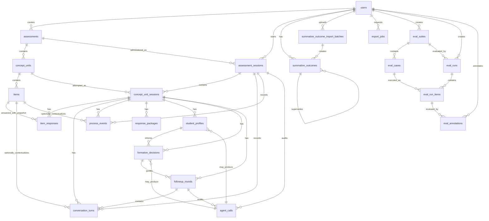

# Data Model

Phase 2A added the normalized database foundation for the classroom prototype. Later sections document the incremental Phase 2B, Phase 3, Phase 4, Phase 5A, Phase 5B, Phase 6, Phase 7A, Phase 7B, Phase 7C, and Phase 7D additions. The data model supports roster-managed student accounts, audited profiling, planning, first-round follow-up records, Phase 6D2B staged iterative follow-up evidence updates inside the current concept unit, Phase 6D3 deterministic student-led concept progression/completion, Phase 7B export of persisted platform records, Phase 7C response collection mode snapshots for initial-administration free-text handling, and Phase 7D item verification run audit records. It still does not imply adaptive concept routing or item generation/rewrite behavior.

## Identifier Convention

- Internal database relations use UUID primary keys named `id`.
- Internal foreign keys use `*_db_id`.
- Public, classroom, route, and export identifiers use explicit public fields:
  - `users.user_id`
  - `assessments.assessment_public_id`
  - `concept_units.concept_unit_public_id`
  - `items.item_public_id`
  - `assessment_sessions.session_public_id`
- Internal UUIDs should not be used as classroom IDs, research IDs, route IDs, or export IDs by default.
- Timestamps use PostgreSQL `TIMESTAMPTZ` so they are stored consistently as UTC instants.

## Model Purposes

- `users`: Existing auth users. `user_id` is the canonical classroom and research linkage ID. `user_id_normalized` is used for case/trim-insensitive matching and uniqueness. `display_name` is optional. `account_status`, `auth_version`, `credential_updated_at`, `deactivated_at`, and `last_login_at` support roster-managed student accounts.
- `assessments`: Top-level assessment containers created by a teacher researcher. `response_collection_mode` controls future session behavior for initial-administration free-text handling.
- `concept_units`: Concept-based item sets. A service-layer rule will later enforce 3 to 4 items.
- `items`: Versioned MCQ item content, including structured options, rationales, expected reasoning, misconception indicators, administration rules, and the teacher-selected `included_in_published_set` membership flag.
- `assessment_sessions`: A student assessment attempt for one assessment. `response_collection_mode_snapshot` freezes the assessment's response collection mode for that attempt.
- `concept_unit_sessions`: A student's progress through a concept unit within a session.
- `item_responses`: Initial item responses with correctness, confidence, reasoning, idempotency, and item content snapshots.
- `student_action_idempotency_keys`: Student action idempotency records for repeated browser requests during initial administration.
- `conversation_turns`: Student, agent, system, orchestrator, and teacher-researcher messages across initial and follow-up phases.
- `process_events`: Process telemetry such as page visibility, pauses, invalid help requests, prompt injection attempts, and phase events.
- `agent_calls`: Audit storage for LLM calls. Phase 6A adds provider/prompt/model audit fields and mock execution support; Phase 6B, Phase 6C, Phase 6D1, and Phase 6D2B connect profiling, planning, follow-up, and updated follow-up evidence cycles through controlled backend services.
- `response_packages`: Structured packages assembled for downstream profiling/planning. `package_type` remains a string in the database but is validated in TypeScript.
- `student_profiles`: Storage for the three-layer profile: ability, engagement, and integrated diagnostic profile.
- `formative_decisions`: Storage for formative value decisions and action plans.
- `followup_rounds`: Iterative follow-up rounds. There is no pedagogical maximum number of rounds.
- `followup_update_cycles`: Staged, auditable update cycles created from follow-up evidence packages. Staged profile/planning/opening outputs are not active records until the full cycle commits successfully.
- `concept_progression_records`: Student-controlled progression/completion audit records. They link the source concept-unit session, optional destination concept unit, source active profile/decision, optional final update cycle, student choice, resolution status, and unresolved-evidence flags.
- `summative_outcomes`: Audited linkage to supervised summative assessment scores by `users.user_id`, with active/superseded revisions.
- `summative_outcome_import_batches`: Audited preview/commit batches for teacher_researcher CSV imports.
- `export_jobs`: Teacher_researcher master CSV export job tracking with public export IDs and local storage keys.
- `workflow_jobs`: Phase 6D2A Postgres-backed asynchronous jobs for automatic profiling, planning, and first follow-up startup.
- `workflow_overrides`: Append-only teacher_researcher exception controls for automatic sessions.
- `roster_import_batches`: Phase 7A teacher_researcher roster preview/commit audit batches. They store normalized preview payloads but never plaintext access codes.
- `student_account_events`: Phase 7A append-only audit events for student creation, display-name update, access-code reset, deactivation, and reactivation. They never store plaintext access codes or hashes.
- `item_verification_runs`: Phase 7D advisory semantic verification runs for teacher-authored concept-unit item sets. Runs store a content fingerprint, deterministic validation result, optional agent-call link, output payload, warning counts, acknowledgement metadata, and timestamps. They do not store student data or rewritten/generated content.

## Key Relations

- `assessments.created_by_user_db_id -> users.id`
- `concept_units.assessment_db_id -> assessments.id`
- `items.concept_unit_db_id -> concept_units.id`
- `assessment_sessions.user_db_id -> users.id`
- `assessment_sessions.assessment_db_id -> assessments.id`
- `student_action_idempotency_keys.assessment_session_db_id -> assessment_sessions.id`
- `concept_unit_sessions.assessment_session_db_id -> assessment_sessions.id`
- `concept_unit_sessions.concept_unit_db_id -> concept_units.id`
- `item_responses.concept_unit_session_db_id -> concept_unit_sessions.id`
- `item_responses.item_db_id -> items.id`
- `conversation_turns`, `process_events`, and `agent_calls` attach to assessment sessions and optionally concept-unit sessions, items, or follow-up rounds.
- `student_profiles`, `formative_decisions`, `followup_rounds`, `followup_update_cycles`, and `response_packages` attach to concept-unit sessions.
- `followup_update_cycles` reference their source follow-up round, source active profile, source active decision, evidence package, and agent-call rows where available.
- `concept_progression_records` attach to assessment sessions and source concept-unit sessions, optionally reference the destination concept unit, source active profile, source active decision, and final update cycle.
- `summative_outcomes.user_db_id -> users.id` and also stores `user_id_snapshot`.
- `summative_outcomes.import_batch_db_id -> summative_outcome_import_batches.id` when created from an import batch.
- `summative_outcome_import_batches.uploaded_by_user_db_id -> users.id`.
- `export_jobs.requested_by_user_db_id -> users.id`.
- `workflow_jobs.assessment_session_db_id -> assessment_sessions.id`.
- `workflow_jobs.concept_unit_session_db_id -> concept_unit_sessions.id` when the job is scoped to a concept unit.
- `workflow_overrides.assessment_session_db_id -> assessment_sessions.id`.
- `workflow_overrides.concept_unit_session_db_id -> concept_unit_sessions.id` when scoped to a concept unit.
- `workflow_overrides.created_by_user_db_id -> users.id`.
- `roster_import_batches.uploaded_by_user_db_id -> users.id`.
- `student_account_events.student_user_db_id -> users.id`.
- `student_account_events.performed_by_user_db_id -> users.id`.
- `student_account_events.roster_import_batch_db_id -> roster_import_batches.id` when the event came from a roster commit.
- `item_verification_runs.concept_unit_db_id -> concept_units.id`.
- `item_verification_runs.agent_call_db_id -> agent_calls.id` when a provider execution was attempted.
- `item_verification_runs.acknowledged_by_user_db_id -> users.id` when advisory warnings were acknowledged.
- `concept_units.latest_item_verification_run_db_id -> item_verification_runs.id` points to the latest completed verification run but freshness is determined by matching the stored content fingerprint to current content.

## Uniqueness Constraints

- Public IDs are unique for assessments, concept units, items, and assessment sessions.
- `users.user_id`: unique canonical classroom/research ID.
- `users.user_id_normalized`: unique normalized classroom/research ID, preventing case-only duplicates.
- `concept_units`: unique `assessment_db_id + order_index`.
- `items`: unique `concept_unit_db_id + item_order`.
- `assessment_sessions`: unique `user_db_id + assessment_db_id + attempt_number` so v1 has one default attempt while future teacher-authorized retakes can use attempt 2 or later.
- `concept_unit_sessions`: unique `assessment_session_db_id + concept_unit_db_id`.
- `item_responses`: unique `concept_unit_session_db_id + item_db_id` to prevent duplicate initial responses.
- `item_responses`: unique `concept_unit_session_db_id + client_submission_id` for idempotent client submission handling.
- `student_action_idempotency_keys`: unique `assessment_session_db_id + client_action_id` for idempotent item actions.
- `followup_rounds`: unique `concept_unit_session_db_id + round_index`.
- `followup_update_cycles.cycle_public_id`: unique public update-cycle identifier.
- `followup_update_cycles`: at most one active non-terminal cycle per concept-unit session.
- `concept_progression_records.progression_public_id`: unique public progression identifier.
- `concept_progression_records.idempotency_key`: unique logical progression key.
- `concept_progression_records`: one active progression record per source concept-unit session through a partial PostgreSQL unique index.
- `summative_outcomes.outcome_public_id`: unique public outcome identifier.
- `summative_outcomes`: active records are logically unique by `user_db_id + outcome_name + assessment_date`; older versions are preserved as `superseded`.
- `summative_outcome_import_batches.batch_public_id`: unique public import-batch identifier.
- `export_jobs.export_public_id`: unique public export-job identifier.
- `workflow_jobs.job_public_id`: unique public workflow-job identifier.
- `workflow_jobs.idempotency_key`: unique logical job key so the same automatic step does not execute successfully twice.
- `workflow_overrides.override_public_id`: unique public override identifier.
- `roster_import_batches.batch_public_id`: unique public roster import batch identifier.
- `student_account_events.event_public_id`: unique public account-event identifier.
- `item_verification_runs.verification_public_id`: unique public verification identifier.

The schema intentionally avoids constraints that would prevent future legitimate reassessment attempts across different assessment sessions.

## Indexes

The schema indexes:

- Public IDs through unique indexes.
- Assessment/session lookup by user, assessment, status, and phase.
- Student action idempotency by session and action type.
- Concept-unit ordering within assessments.
- Item ordering within concept units.
- Conversation turns by session and time.
- Process events by session, concept-unit session, event type, item, and occurrence time.
- Agent calls by session, concept-unit session, follow-up round, agent name, status, provider, client request ID, optional invocation key, and creation time.
- Student profiles and formative decisions by concept-unit session and creation time.
- Follow-up rounds by concept-unit session and round index.
- Summative outcomes by user and assessment date.
- Summative outcome import batches by uploader and status.
- Export jobs by requester, status, and expiration.
- Workflow jobs by status/run-after time, session/status, concept-unit/status, and lock time.
- Workflow overrides by session, concept-unit, action type, and creation time.
- Concept progression records by assessment session/request time, source concept-unit session/status, destination concept, source profile/decision, progression type/status, and final update cycle.
- User lookup by `user_id_normalized`.
- Roster import batches by uploader, status, and creation time.
- Student account events by student, performer, event type, batch, and creation time.
- Assessment and session response collection mode for Phase 7C review/export filters.
- Item verification runs by concept unit, public verification ID, agent-call link, acknowledgement user, status, verification status, and creation time.

## Phase 7C Response Collection Mode

Phase 7C adds:

- `ResponseCollectionMode`: `deterministic` or `llm_assisted`.
- `assessments.response_collection_mode`: teacher-configured mode for future sessions. New assessments default to `llm_assisted`; existing migrated assessments are backfilled to `deterministic`.
- `assessment_sessions.response_collection_mode_snapshot`: copied from the assessment when the session starts. Existing migrated sessions are backfilled to `deterministic`.

Changing assessment mode is governed like other content-affecting assessment settings. After student sessions exist, normal content governance blocks mode changes for that assessment. Existing sessions keep their snapshot and are not altered by later teacher edits.

The Response Collection Agent receives only student-safe current item content and procedural policy. It does not receive answer keys, correctness, distractor rationales, expected reasoning patterns, misconception indicators, profile labels, formative decisions, summative outcomes, passwords, access-code hashes, session cookies, API keys, database URLs, or raw environment values.

Free-text student messages are persisted as `conversation_turns` before agent or fallback handling. Response Collection Agent and deterministic fallback assistant turns are also persisted as conversation turns with safe structured metadata. Process events record neutral activity such as `response_collection_fallback_used`, `response_collection_reasoning_extracted`, `invalid_help_request`, and `prompt_injection_attempt`; these events are context, not misconduct evidence.

## Phase 7A Student Accounts

Phase 7A adds roster-managed student account fields to `users`:

- `user_id_normalized`: trim/Unicode-normalized/lowercase match key.
- `display_name`: optional teacher-managed display label.
- `account_status`: `active` or `inactive`.
- `auth_version`: included in server-managed sessions so credential resets and status changes invalidate old cookies.
- `deactivated_at`: administrative deactivation timestamp.
- `credential_updated_at`: access-code reset or creation timestamp.
- `last_login_at`: successful login timestamp.

Student login resolves by `user_id_normalized` but preserves canonical `users.user_id` for display, route parameters, summative outcome linkage, and master CSV export. Normal teacher UI/API routes cannot edit `users.user_id` or `users.user_id_normalized`.

`roster_import_batches` records preview/commit audit data:

- `batch_public_id`
- uploader relation
- source file name
- status: `previewed`, `committed`, `failed`, or `cancelled`
- preview counts
- committed counts
- normalized preview payload
- validation summary
- timestamps

Preview never creates users or access codes. Commit creates valid new students, optionally applies display-name changes, and returns plaintext access codes only in the authenticated response.

`student_account_events` is append-only:

- `student_created_manually`
- `student_created_by_roster`
- `display_name_updated`
- `access_code_reset`
- `student_deactivated`
- `student_reactivated`

Account events do not store plaintext access codes, access-code hashes, passwords, session cookies, or environment values.

## Phase 6D2A Assessment Availability And Workflow

`assessments` adds:

- `workflow_mode`: `manual_review` or `automatic`; existing assessments are backfilled to `manual_review`, while new assessments default to `automatic`.
- `release_at`: nullable UTC timestamp. Null means available immediately after publishing.
- `close_at`: nullable UTC timestamp. Null means no closing date.

`assessment_sessions` adds:

- `workflow_mode_snapshot`: copied from the assessment when the session starts, so later assessment changes affect only future sessions.
- `automation_paused_at`: nullable pause marker for automatic sessions.
- `automation_exception_reason`: sanitized reason for blocked automatic workflow state.

Release/close windows control new starts only. Existing sessions may resume after release/close changes and after the closing date. Closing does not submit, expire, or invalidate a session.

`workflow_jobs` stores asynchronous automatic steps:

- `run_initial_profiling`
- `run_initial_planning`
- `start_initial_followup`

Job statuses are `pending`, `running`, `retryable`, `completed`, `failed`, and `cancelled`. Jobs store attempt counts, max attempts, run-after time, lock metadata, sanitized error details, and public IDs. Job payloads must not store secrets.

`workflow_overrides` is append-only. Approved Phase 6D2A action types are `pause_automation`, `resume_automation`, `retry_current_step`, and `stop_followup`.

## Deletion Behavior

This system stores classroom and research records, so destructive cascade deletion is avoided.

- Core research records use `onDelete: Restrict`.
- Optional pointer fields use `onDelete: SetNull`:
  - `assessment_sessions.current_concept_unit_db_id`
  - `concept_unit_sessions.latest_student_profile_db_id`
  - `concept_unit_sessions.latest_formative_decision_db_id`
  - `student_profiles.based_on_agent_call_db_id`
  - `formative_decisions.based_on_agent_call_db_id`
  - `followup_rounds.updated_student_profile_db_id`

Status fields such as `archived`, `needs_review`, `student_exited`, and `completed` should be preferred over deleting research records.

## JSON Fields

JSON fields store naturally structured research and orchestration payloads:

- `items.options`
- `items.distractor_rationales`
- `items.expected_reasoning_patterns`
- `items.possible_misconception_indicators`
- `items.administration_rules`
- `item_responses.item_snapshot`
- `conversation_turns.structured_payload`
- `process_events.payload`
- `agent_calls.input_payload`, `raw_output`, `output_payload`, and `token_usage`
- `response_packages.payload`
- profile pattern flags, misconception indicators, item-level evidence, process cautions, and recommended next evidence
- formative decision target evidence, success criteria, prompt constraints, and update triggers

## Item Snapshot Rationale

Published item content must remain auditable. `items.version` supports item version tracking, and `item_responses.item_snapshot` plus `item_version_snapshot` preserves the item content used when the student responded. Later edits to an item should not corrupt interpretation of earlier research records.

## Phase 3A Content Management

Phase 3A implements teacher_researcher-only backend content management over the existing `assessments`, `concept_units`, and `items` tables.

Content API responses use public IDs:

- `assessment_public_id`
- `concept_unit_public_id`
- `item_public_id`

Internal UUIDs and `*_db_id` foreign keys remain internal service/database details and are not returned by the Phase 3A content route payloads.

Concept units represent concept-based item sets. A draft concept unit may contain more than 4 candidate items. A concept unit is publishable only when it has exactly 3 to 4 active items with `included_in_published_set = true`, nonempty concept metadata, unique item order values, and every included active item passes item validation.

Item options are structured JSON:

```json
[
  { "label": "A", "text": "Option A" },
  { "label": "B", "text": "Option B" }
]
```

Phase 3A allows 2 to 6 options per item. `correct_option` must match an option label. For publishing, every incorrect option must have a distractor rationale, and each item must include expected reasoning patterns plus possible misconception indicators.

Draft content can be edited. Content-relevant item and concept-unit changes increment `version`. If an item already has student responses, destructive changes to `item_stem`, `options`, `correct_option`, or `distractor_rationales` are rejected because prior responses must remain auditable.

Phase 3C adds computed content lifecycle state:

- `draft_editable`
- `published_unused`
- `locked_after_student_session`
- `archived`

Lock state is computed from the existence of at least one `assessment_sessions` row for the assessment. After locking, research-relevant assessment, concept-unit, and item content is read-only. Whole-assessment archive remains available to prevent future sessions while preserving historical records.

Distractor rationales, expected reasoning patterns, and misconception indicators are not feedback to students during initial administration. They are teacher/research metadata that later support Student Profiling Agent inference.

## Three-Layer Profile Storage

`student_profiles` stores:

- `ability_profile`: quality of demonstrated understanding.
- `engagement_profile`: participation and evidence interpretability.
- `integrated_diagnostic_profile`: combined diagnostic interpretation for formative planning.

Process data are contextual evidence for engagement and evidence sufficiency, not proof of misconduct.

## Process Event Taxonomy

`process_events.event_type` is a string so the event taxonomy can expand over time without database enum migrations. Application payloads should validate against `src/lib/domain/enums.ts`, which currently contains the approved Phase 2A event types.

Phase 2B adds `logProcessEvent`, which validates `event_source` and `event_type` before writing. Process events are contextual evidence for engagement and evidence sufficiency. They are not misconduct labels.

## Conversation Turn Logging

Phase 2B adds `logConversationTurn`, which validates `phase` and `actor_type` before writing. Conversation turns are append-only records for student, agent, system, orchestrator, and teacher-researcher messages. The service supports both initial-administration and future follow-up turns, but Phase 2B does not implement any LLM agent or student conversation flow.

## Session State Persistence

Phase 2B adds deterministic session-state services for starting sessions, reading state, updating phases, marking review/exited/completed states, and touching activity time. Phase updates validate transitions before writing and log phase/transition process events.

The transition map is deterministic:

- `not_started -> session_started`
- `session_started -> concept_unit_intro`
- `concept_unit_intro -> initial_item_administration`
- `initial_item_administration -> missing_evidence_repair | initial_concept_unit_completed`
- `missing_evidence_repair -> initial_item_administration`
- `initial_concept_unit_completed -> profiling_pending`
- `profiling_pending -> profiling_completed`
- `profiling_completed -> planning_pending`
- `planning_pending -> planning_completed`
- `planning_completed -> followup_active | between_concept_units`
- `followup_active -> followup_profile_update_pending | followup_stopped`
- `followup_profile_update_pending -> followup_planning_update_pending | followup_active`
- `followup_planning_update_pending -> followup_active`
- `followup_stopped -> between_concept_units`
- `between_concept_units -> concept_unit_intro | session_completed`

Active phases may also transition to `student_exited`, and blocking failures may transition to `needs_review`. `session_completed` is terminal.

## Phase 4A Initial Administration State

Phase 4A adds the smallest schema changes needed for backend-only student initial administration:

- `assessment_sessions.attempt_number`: defaults to `1`; combined with `user_db_id + assessment_db_id` to prevent duplicate v1 attempts while preserving future retake support.
- `assessment_sessions.resume_phase`: stores the phase to restore when a student explicitly exits a take-home session.
- `assessment_sessions.resume_context`: stores structured resume context when needed. The Phase 4A service primarily derives position from database state rather than trusting a client-supplied resume pointer.
- `item_responses.skipped_item`: distinguishes a deliberately skipped whole item from an unanswered draft.
- `student_action_idempotency_keys`: prevents duplicated process events, conversation turns, and revision increments when a browser repeats the same student action with the same `client_action_id`.

Initial administration uses stable published content:

- Session start verifies the assessment is published, not archived, and has at least one valid published concept unit.
- Only published concept units and published included items are administered.
- Concept units follow teacher-defined `order_index`.
- Items follow teacher-defined `item_order`.
- Session creation establishes the Phase 3C content lock because the assessment now has an `assessment_sessions` row.

Initial response baseline:

- `item_responses` stores the latest selected option, reasoning text, confidence rating, backend-calculated correctness, skipped flags, revision count, timing, item version snapshot, and item content snapshot for the initial administration baseline.
- Revisions are allowed until `concept_unit_sessions.initial_completed_at` is set.
- Conversation turns and process events preserve response and revision history.
- Follow-up evidence must later be stored separately and must not overwrite these initial response rows.

Missing evidence and skips:

- `missing_evidence_repair_offered` records that the one repair opportunity was offered.
- Explicit skips record `skipped_item`, `skipped_reasoning`, and/or `skipped_confidence`.
- A skipped whole item uses `ResponseCorrectness.unanswered`, not `incorrect`.

Response-package creation:

- After every included active item has a finalized response or explicit skip, Phase 4A sets `initial_completed_at`, transitions the assessment session to `profiling_pending`, and creates one `initial_concept_unit_response_package`.
- That package is backend/research data and may include correctness, item snapshots, process-event aggregations, and transcript evidence. It is not returned to students.

## Response Package Types

The initial stable response package types are:

- `initial_concept_unit_response_package`: evidence collected after initial administration of a concept-based item set, before initial profiling.
- `followup_evidence_update_package`: meaningful new evidence collected during follow-up, intended for profile update.
- `combined_concept_unit_evidence_package`: combined initial and follow-up evidence for the current concept unit.

The database keeps `response_packages.package_type` as a string to avoid unnecessary migration churn, while `src/lib/domain/enums.ts` validates package types in application code.

Phase 2B implements `createResponsePackage` for `initial_concept_unit_response_package`. Multiple response package rows are allowed because they are timestamped audit artifacts. Later phases may choose when to create updated package versions.

Initial response package payloads include:

- assessment session identifiers and current phase
- assessment public metadata
- concept unit metadata
- included item metadata
- item responses with selected option, backend correctness, reasoning, confidence, skipped flags, revisions, timing, item snapshots, and item version snapshots
- relevant conversation turns
- relevant process events
- process counts, including page switching, long pauses, invalid help requests, prompt injection attempts, procedural clarifications, emotional responses, agent retries, validation failures, and follow-up turn count

## Phase 5A Teacher Review Reads

Phase 5A does not add database tables. It adds read-only services and teacher_researcher APIs over the existing normalized schema:

- `assessment_sessions` supplies session status, phase, attempts, review flags, activity timestamps, and public session IDs.
- `users.user_id` is the student-facing and research-facing identifier shown in review views.
- `assessments`, `concept_units`, and `items` supply current content metadata and public IDs.
- `item_responses.item_snapshot` and `item_version_snapshot` supply the administered item snapshot used for auditability.
- `conversation_turns` supply chronological transcript evidence.
- `process_events` supply chronological process context and neutral aggregate counts.
- `response_packages.payload` supplies stored package evidence for later agent phases.

Normal Phase 5A API serializers remove internal UUID keys such as `id` and `*_db_id` from teacher-facing payloads. Stored JSON may contain historical internal keys from earlier package creation, but review serializers strip those keys before returning normal API responses.

Phase 5A does not populate `student_profiles`, `formative_decisions`, `followup_rounds`, or `agent_calls`. Empty future-agent UI states must remain empty rather than calculating substitute profiles or decisions.

## Phase 6A Agent-Call Audit Records

Phase 6A makes `agent_calls.assessment_session_db_id` nullable so synthetic infrastructure tests and future non-session agent calls can be audited without attaching to a real student session. Classroom workflow calls later should attach to the relevant session when applicable.

`agent_calls` now stores:

- `provider`: `mock` or `openai`.
- `provider_response_id` and `provider_request_id`: provider metadata when available.
- `client_request_id`: server-generated request identifier.
- `agent_invocation_key`: optional idempotency key for replay protection.
- `prompt_hash`: SHA-256 hash of the registered prompt version, schema version, and instructions.
- `reasoning_effort`, `verbosity`, and `max_output_tokens`: request options when configured.
- `refusal_text`, `incomplete_reason`, and `error_category`: sanitized non-success outcomes.
- `started_at` and `completed_at`: execution timing.

Existing fields continue to store agent name, agent version, model name, prompt version, schema version, redacted input payload, raw output, output payload, validation status, retry count, latency, token usage, and call status.

Phase 6D1 adds `agent_calls.followup_round_db_id` so Follow-up Agent audit rows can be linked to the exact follow-up round that produced the assistant turn.

The Phase 6A execution service validates input/output schemas, redacts audit payloads, blocks prohibited secret/auth fields before provider execution, retries retryable provider failures, and records structured output validation results.

Phase 6A mock smoke tests may create synthetic `agent_calls` rows and remove only their own rows. They must not create `student_profiles`, `formative_decisions`, or `followup_rounds`, and they must not alter assessment session phases.

Phase 6A.5 adds usage-control audit fields to `agent_calls`:

- `blocked_reason`: typed reason when a future live call is blocked before provider execution.
- `usage_guard_snapshot`: server-side snapshot used for the decision.
- `live_call_allowed`: whether a live provider call was permitted for that audit row.
- `usage_window_start` and `usage_window_end`: UTC timestamps for the configured usage day.

These fields support classroom usage safeguards and teacher-visible monitoring. They are operational controls, not student profile labels.

## Phase 6B Student Profile Records

Phase 6B uses the existing `student_profiles` table for validated Student Profiling Agent output after initial concept-unit administration. No schema migration is required for Phase 6B.

Profile creation rules:

- Input is built from an allowlisted `StudentProfilingInput`, not raw Prisma objects.
- The input may include teacher/researcher-side item diagnostic metadata such as distractor rationales and possible misconception indicators because the agent is backend-only.
- Password hashes, access-code hashes, cookies, auth tokens, API keys, environment variables, unrelated summative outcomes, and unnecessary internal UUIDs are excluded.
- A profile row is created only when `executeAgent` returns a schema-valid `StudentProfileOutput`.
- `student_profiles.based_on_agent_call_db_id` links the profile to the audited `agent_calls` row.
- `concept_unit_sessions.latest_student_profile_db_id` points to the latest saved profile for the concept-unit session.
- The assessment session moves from `profiling_pending` to `profiling_completed` after successful profile persistence.

Idempotency is enforced through `agent_calls.agent_invocation_key`, derived from concept-unit session, response package, profile type, prompt version, schema version, and prompt hash. Retrying the same successful profiling request returns the existing profile instead of creating a duplicate.

Failed, refused, incomplete, invalid-output, or usage-blocked profiling executions do not create `student_profiles`, `formative_decisions`, or `followup_rounds`.

Mock provider profile rows are infrastructure-testing records and should not be interpreted as validated research inferences.

## Phase 6C Formative Decision Records

Phase 6C uses the existing `formative_decisions` table for validated Formative Value and Planning Agent output after a saved Student Profiling Agent profile exists. No schema migration is required for Phase 6C.

Decision creation rules:

- Input is built from an allowlisted `FormativePlanningInput`, not raw Prisma objects.
- The input uses the latest saved `student_profiles` row, the latest `initial_concept_unit_response_package`, public concept metadata, previous safe formative-decision summaries, the approved formative-value taxonomy, and the default integrated-profile-to-formative-value mapping.
- Password hashes, access-code hashes, cookies, auth tokens, API keys, environment variables, unrelated summative outcomes, and unnecessary internal UUIDs are excluded.
- A decision row is created only when `executeAgent` returns a schema-valid `FormativePlanningOutput` and semantic validation passes.
- Semantic validation checks the default mapping metadata, substantive deviation rationale when needed, nonempty planning fields, and prohibited misconduct or certainty language.
- `formative_decisions.student_profile_db_id` links the decision to the saved profile used as input.
- `formative_decisions.based_on_agent_call_db_id` links the decision to the audited `agent_calls` row.
- `concept_unit_sessions.latest_formative_decision_db_id` points to the latest saved decision for the concept-unit session.
- The assessment session moves from `profiling_completed` through `planning_pending` to `planning_completed` after successful decision persistence.

Idempotency is enforced through `agent_calls.agent_invocation_key`, derived from concept-unit session, saved profile, response package, prompt version, schema version, and prompt hash. Retrying the same successful planning request returns the existing decision instead of creating a duplicate.

Failed, refused, incomplete, schema-invalid, semantically invalid, or usage-blocked planning executions do not create `formative_decisions` or `followup_rounds`.

Mock provider planning rows are infrastructure-testing records and should not be interpreted as validated educational guidance.

## Phase 6D1 Follow-Up Records

Phase 6D1 uses the existing `followup_rounds` and `conversation_turns` tables, plus the new `agent_calls.followup_round_db_id` audit link, for the first open-ended follow-up conversation round after planning completes.

Follow-up creation rules:

- Input is built from an allowlisted `FollowupInput`, not raw Prisma objects.
- The input uses the latest saved profile, latest saved formative decision, item response evidence, current round state, bounded recent transcript, latest student reply when applicable, process-event aggregates, and Phase 6D1 constraints.
- Password hashes, access-code hashes, cookies, auth tokens, API keys, environment variables, unrelated summative outcomes, and unnecessary internal UUIDs are excluded.
- A teacher_researcher manual trigger creates an auditable follow-up round attempt and activates it only after a valid opening assistant message is generated.
- Student follow-up messages are stored as `conversation_turns` before provider execution so failed assistant replies do not discard student evidence.
- Assistant replies are stored only when `executeAgent` returns a schema-valid `FollowupOutput` and semantic validation passes.
- `agent_calls.followup_round_db_id` links follow-up agent executions to the active round.
- The assessment session moves from `planning_completed` to `followup_active` after a valid opening turn.
- Student stop marks the round `stopped` and moves the assessment session to `followup_stopped`.

Idempotency is enforced through student action idempotency keys for student-submitted follow-up messages and through agent invocation keys for provider calls. Repeating the same successful student message does not duplicate student or assistant turns.

Failed, refused, incomplete, schema-invalid, semantically invalid, or usage-blocked follow-up executions do not create an assistant reply, do not update `student_profiles`, do not update `formative_decisions`, do not create response packages, and do not start another concept unit.

Mock provider follow-up rows are infrastructure-testing records and should not be interpreted as validated formative guidance.

## Phase 5B Outcome And Phase 7B Export Records

Phase 5B adds audited summative outcome import and master CSV export records while keeping the internal database normalized.

`summative_outcome_import_batches` stores preview and commit audit metadata:

- `batch_public_id` is the teacher-facing import batch identifier.
- `uploaded_by_user_db_id` links to the teacher_researcher who uploaded or pasted the CSV.
- count fields store total, valid, invalid, duplicate, conflict, unmatched, and committed row counts.
- `validation_summary` stores teacher-facing validation details.
- `normalized_rows` stores the server-preserved normalized preview representation used at commit time.
- Preview writes only the batch record. It does not write `summative_outcomes`.

`summative_outcomes` stores supervised outcomes:

- `outcome_public_id` is the teacher-facing outcome identifier.
- `user_db_id` links to the student user; `user_id_snapshot` preserves the research-facing ID at import time.
- `import_batch_db_id` and `source_row_number` link records back to import audit context when available.
- `record_status` is `active` or `superseded`.
- `revision_number` and `supersedes_outcome_db_id` preserve replacement history.
- Active exports use only active outcome records by default.

The logical active duplicate key is `user_db_id + outcome_name + assessment_date`. Exact duplicates can be treated as idempotent existing records. Conflicting values for the same logical key are rejected unless an explicit replacement action supersedes the previous active record and creates a new active revision.

`export_jobs` stores master CSV jobs:

- `export_public_id` is the teacher-facing export identifier.
- `requested_by_user_db_id` links to the requesting teacher_researcher.
- `status` is `pending`, `processing`, `completed`, `failed`, or `expired`.
- `file_name` is normally `master_assessment_export.csv`.
- `storage_key` is server-generated and never accepted from clients.
- `row_count`, `options`, `export_schema_version`, timestamps, expiration, and failure message support auditability.

Local Phase 5B export files are written under `.data/exports`, outside public static folders. Production deployment should replace this local storage with persistent object storage while preserving authorization and path-traversal protections.

The master CSV is a derived analysis file. It is not a denormalized database source of truth. Normal exports use public IDs and `users.user_id`, not internal UUIDs.

Phase 7B export services read the normalized records without mutating them. The export includes persisted account status, assessment availability, session workflow snapshots, activated profiles and formative decisions, follow-up rounds, follow-up update cycles, concept progression records, completion records, workflow jobs, workflow overrides, actual agent-call audit metadata, and active summative outcomes.

Concept-specific export histories are scoped to each row's `concept_unit_session`. Failed/staged update-cycle JSON remains audit evidence and does not populate active/latest scalar profile or formative-decision fields. Session-only placeholder rows leave concept-specific scalar fields blank.

## Phase 7E1 Evaluation Harness

Phase 7E1 adds normalized evaluation tables that are separate from classroom workflow records.

`eval_suites` groups cases by active agent:

- `suite_public_id` is the teacher-facing suite identifier.
- `agent_name` must be one of the five active agents.
- `created_by_user_db_id` links to the teacher_researcher who created or seeded the suite.

`eval_cases` stores synthetic, teacher-authored, or deidentified evaluation inputs:

- `case_public_id` is the teacher-facing case identifier.
- `case_source` is `synthetic`, `teacher_authored`, or `deidentified`.
- Phase 7E1 fixtures populate only `synthetic` cases.
- `input_payload`, `expected_output`, `gold_labels`, rubric expectations, and safety expectations contain eval-only evidence.

`eval_runs` stores one mock or future imported/live run for one suite:

- `run_public_id` is the teacher-facing run identifier.
- `run_mode` is `mock`, `imported_output`, or `live_provider`.
- Phase 7E2A implements a guarded `live_provider` canary for synthetic cases only.
- `provider=mock` rows may store `EVAL_TARGET_MODEL` as future target metadata, not as a live provider call.
- live canary rows store exact model snapshot, reasoning effort, planned item count, provider request count, pricing registry version, budget limit, estimated cost, case manifest hash, run config hash, canary gate status, and a reproducibility manifest.

`eval_run_items` stores one output per case repetition:

- `run_item_public_id` is the teacher-facing item identifier.
- schema validation, semantic validation, safety validation, latency, token metadata, raw output, and parsed output are captured for review.
- live canary items additionally store idempotency key, run order, max output tokens, prompt/schema versions, provider response/request IDs, client request ID, retry count, error category, token fields, estimated cost, and started/completed timestamps.
- Eval outputs do not create `agent_calls`, `student_profiles`, `formative_decisions`, `followup_rounds`, `item_verification_runs`, sessions, item responses, or workflow jobs.

`eval_annotations` stores teacher_researcher expert review:

- one annotation per run item per teacher is upserted.
- blind review, overall rating, pass/fail, rubric scores, critical failure flags, and notes are retained.

`eval_rubrics` stores agent-specific rubric definitions and fixed critical failure flags.

All eval API responses use public IDs and omit password hashes, access-code hashes, cookies, API keys, database URLs, and internal UUIDs.

## Diagram


